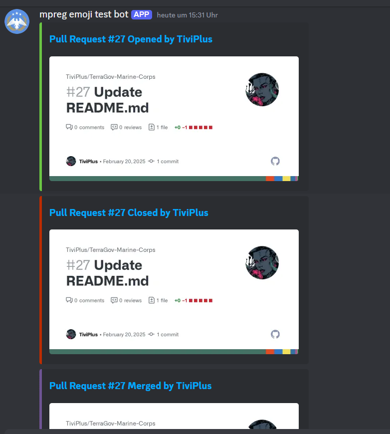

# Discord Notify Action

This action sends a notification to Discord.

## Usage

| Input              |      Required      |  Default  | Description                                                                                                               |
| ------------------ | :----------------: | :-------: | ------------------------------------------------------------------------------------------------------------------------- |
| `webhook_url`      | :white_check_mark: |           | Webhook URL(s) from Discord. comma seperated                                                                                                  |
| `title`            |                    |           | Title for card                                                                                                            |
| `message`          |                    |           | Content of card                                                                                                           |
| `include_image`    |                    |  `false`  | If action is used in a pull request, attach the preview image for it to the card. Can be overridden by `custom_image_url` |
| `colour`           |                    | `#3371FF` | Colour for the edge of the card in hex                                                                                    |
| `username`         |                    | `GitHub`  | Username to send message as                                                                                               |
| `avatar_url`       |                    |           | Avatar to use for user                                                                                                    |
| `custom_image_url` |                    |           | Attach custom image to card, overrides pull request image if set. Requires `include_image` to be `true`                   |
| `title_url`        |                    |           | Make the title of the card this link                                                                                         |

```yaml
name: 'New PR Notification'
on:
  pull_request_target:
    types: [opened, reopened, closed]

jobs:
  notify:
    runs-on: ubuntu-latest
    steps:
      - name: "Check for DISCORD_WEBHOOK"
        id: secrets_set
        env:
          ENABLER_SECRET: ${{ secrets.DISCORD_WEBHOOK }}
        run: |
          unset SECRET_EXISTS
          if [ -n "$ENABLER_SECRET" ]; then SECRET_EXISTS=true ; fi
          echo "SECRETS_ENABLED=$SECRET_EXISTS" >> $GITHUB_OUTPUT
      - name: Send Discord notification
        uses: TiviPlus/discord-notify@v2
        if: steps.secrets_set.outputs.SECRETS_ENABLED
        with:
          webhook_url: ${{ secrets.DISCORD_WEBHOOK }}
          include_image: true
          avatar_url: https://raw.githubusercontent.com/tgstation/TerraGov-Marine-Corps/refs/heads/master/icons/tgmc_64.png
          username: mpreg emoji test bot
          title_url: "${{ github.event.pull_request.html_url }}"
```


